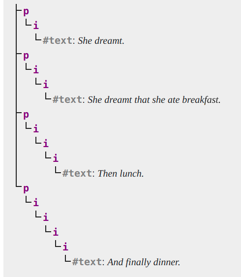
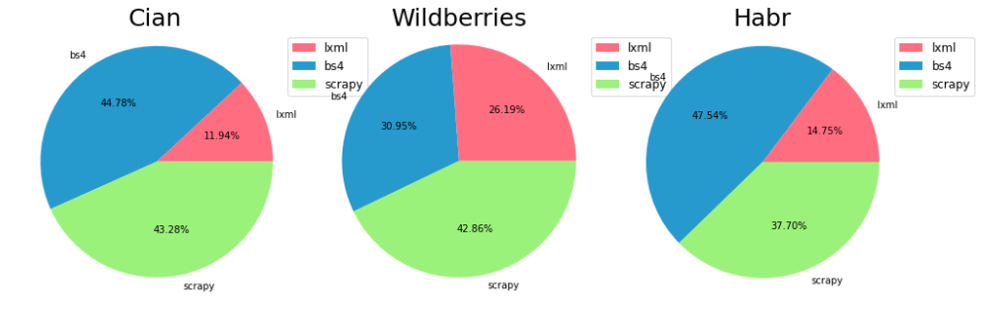

## Парсинг HTML-страниц. Обзор фреймворка lxml.html

Цель проекта: исследовать способ парсинга html библиотекой lxml.html и сравнить время её работы с существующими аналогичными фреймворками (BeautifulSoup4, Scrapy).

## Немного про структуру HTML страниц

HTML — теговый язык разметки документов. Любой документ на языке HTML представляет собой набор элементов, причём начало и конец каждого элемента обозначается специальными пометками — тегами. Элементы могут быть как пустыми, так и непустыми. 

Вот примеры элементов HTML-документа:
```html
<strong> Это парный тег </strong>
<a href="http://www.example.com"> Ссылка, с соответствующим атрибутом</a>
Пример пустого элемента "перевода строки": <br>
```
Сам же HTML документ представляет из себя древовидную струкруту: в каждый элемент может вкладываться другой/другие элемент/элементы.

```html
<!DOCTYPE html>
<html>
   <head>
      <meta charset="utf-8" />
      <title>HTML Document</title>
   </head>
   <body>
    <div>
        <p>
            Блок №1
            <b> подпункт 1 </b>
            <b> подпункт 2 </b>
            <b> подпункт 3 </b>
            
        </p>
        <p>
            Блок №2
            <b> подпункт 1 </b>
            <b> подпункт 2 </b>
            <b> подпункт 3 </b>
        </p>
      </div>
   </body>
</html>
```

У каждого тега может быть как ноль, так и несколько атрибутов: 
```html
  <input
    type="email"
    id="email"
    name="email"
    pattern="[a-z0-9._%+-]+@[a-z0-9.-]+\.[a-z]{2,}$"
    required
  />
```

Как можно заметить из примера не все атрибуты требуют инициализацию значением. В примере поле *required* имеет тип boolean, его присутствие в теге инициализирует атрибут *required* значением true. 


## Сложность парсинга страниц с HTML разметкой 
1)  Большинство веб-страниц основаны на использовании HTML, и структура одной веб-страницы может сильно отличаться от структуры другой. Поэтому для парсинга каждой страницы требуется специально написанный парсер. 
   
2) Сайты с большим объёмом данных обычно не могут выдать сразу весь контент пользователю, так как сбор и обработка данных на уровне сервера может занимать заметное время. Поэтому большие платформы обычно выдают контент частями: выдают страницу с исполняющимся кодом на javascript. 
Для таких сайтов не достаточно просто отправить GET-запрос на хост - нужно промоделировать работу браузера: зайти на сайт и подождать некоторое время пока java-script'ы закончат свою работу
```html 
<script> java-script code </script>
```
3) HTML очень долгое время был плохо специализирован и браузерам приходилось самим учиться "исправлять" ошибки разработчиков. Например, понимать, какие теги являются самозакрывабщими, а какие нет. Ниже представлена схема того, как браузер обрабатывает html, css, перед тем как отобразить страниц пользователю (DOM - Document Object Model).    


Текущую спецификацию языка HTML можно найти, перейдя по сссылке: https://html.spec.whatwg.org/

## Примеры некорректного html-кода
<br/>
1) Нет закрывающихся парных тегов.
 Для того, чтобы понять, где находится конец тега, парсеру приходится дочитывать документ до конца, из-за чего такая синтаксическая ошибка может привести к низкой производительности. Ниже находится пример, показывающий возможный вариант прочтения кода с данной ошибкой:

```html
<p><i>She dreamt.
<p><i>She dreamt that she ate breakfast.
<p><i>Then lunch.
<p><i>And finally dinner.
```
Document Object Model:

  
<br/>
1. Несмотря на неясность выбора тега, который хотел выбрать автор, браузер в том или ином виде корректно отобразит содержащий текст. 

```html
<h1>Contact details</h2>
```
<br/>
3. Обработка опечаток. Иногда браузерам на этапе синтакситеческого анализа удаётся понять, где разработчик опечатался.  

```html
<capton> </caption>
```


## Обзор библиотеки lxml 
Сама по себе lxml - большая CPython библиотека, нас интересует только модуль, занимающийся парсингом и обработкой HTML страниц: lxml.html 

Официальню документацию данной библиотеки можно найти тут: https://lxml.de/lxmlhtml.html 


Плюсы библиотеки:
1) lxml поддерживает формат запросов xpath (описание формата можно найти здесь: https://ru.wikipedia.org/wiki/XPath) 
2) lxml умеет проверять корректность html "по шагам": можно скармливать парсеру html страничку "кусочками" при помощи метода .feed() . Что позволяет быстро обрабатывать большие объёмы данных, так как нет обходимости держать полное синтакситеское дерево в памяти. 
3) Основная часть библиотеки написана на C, что должно позволять быстрее обрабатывать html-страницы, чем библиотеки, написанные на только лишь на python. 


## Представление html страницы
Все браузеры и библиотека lxml хранит xml и html в виде модели DOM (Document Object Model). Любой документ известной структуры может быть представлен с помощью DOM в виде дерева узлов, каждый узел которого представляет собой элемент, атрибут, текстовый, графический или любой другой объект. Узлы связаны между собой отношениями «родительский-дочерний».  

Ниже находится пример представления небольшого html-куска в виде модели DOM:  
```html
<p>To find out <em>more</em>, see the
<a href="http://www.w3.org/XML">standard</a>.</p>
```

   

<br/>
<br/>


## Тестирование библиотеки и сравнение с аналогами

Для проведения тестов было взято 3 сайта: 
1) Cian - сайт по-своему уникален: каждому элементу на странице генерируется свой "случайный" индификатор, из-за чего (гипотеза) парсеры могут тратить большее время на поиск запрашиваемых тегов, так как приходится искать блоки по значению атрибутов. Тестов всего 50, так как cian заботится о своей безопасности, и выдаёт капчу, если запросов к сайту достаточно много. 
2) Wildbrries - большой интернет магазин с огромным множеством товаров на выбор. Сайт использует динамическую загрузку данных при помощи java-script, из-за чего приходится использовать библиотеку selenium для моделирования браузера. Общее число страниц для проведения тестов: 315. 
3) Habr - сайт с тематическими блогами. Сайт имеет довольно простую структуру и основную часть странички занимает блок с авторским контентом, у которго глубина вложенности элементов обычно не больше 2 тегов. Количество заготовленных тестовых страниц: 1000.   


Относительно представленных сайтов wildberries имеет самую сложную html структуру: самая большая вложенность тегов: 21. 

Вот так схематично выглядит дерево только с нужными для извлечения данных тегами. 

```python
#   div class="product-card-list"
#       div class="product-card"
#           div class="product-card__wrapper"
#               div class="product-card__img"
#                   img src="img_url" <- tag-value
#               div class="product-card__brand"
#                   div class="product-card__price-commission"
#
#                      | div class="price-commission"
#                      |     span class="price-commission__current-price" <- inside-value
#                      |     del class="price-commission__old-price" <- inside-value
#
#                      | span price
#                      | span lower-price <- inside-value
#                   div class="product-card__brand-name"
#                       span class="goods-name" <- inside-value
```

## Результаты тестирования:
Вдоль оси Ox отмечены номер группы тестов, вдоль Oy - время.
1) Cian, количество тестов в группе: 1, запусков на каждой группе: 1
  


2) Wildberries, количество тестов в группе: 5, количество запусков на каждой группе: 1


3) Habr, количество тестов в группе: 20, количество запусков на каждой группе: 1


На каждом сайте для каждого парсера было посчитано число тестов, в котором он отработал за меньшее время, чем остальные парсеры. Получилось следующее распределение:


Получился довольно странный результат: библиотека на Cpython оказалась самой медленной. 

Возможные причины полученного результата:
1) Так как все документы имеют относительно небольшой размер, то измерение времени работы проходило с маленькой точностью
2) В документации написано, что lxml работает быстро с "высококачественными" страницами, а представленные страницы таковыми не являются (можно заметить, что у cian и wildberries присутствует множество java-script кода, который синтаксические анализаторы считают невалидными)
3) Большой вклад во время вносят системные операции
4) Разный обход DOM - деревьев


## Результаты
lxml показал себя хуже, чем аналоги

В папке calculations находятся исходники измерения времени работы парсеров <br>
В папке parsers находятся парсеры каждой из структур <br>
В папке tests находятся генераторы тестов вместе с данными, использовавшимися для тестирования
<br/>
В файле research.ipynb находится код построения диаграмм
